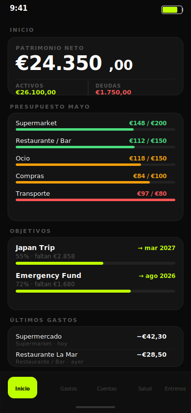
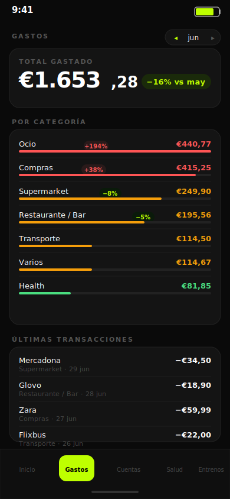
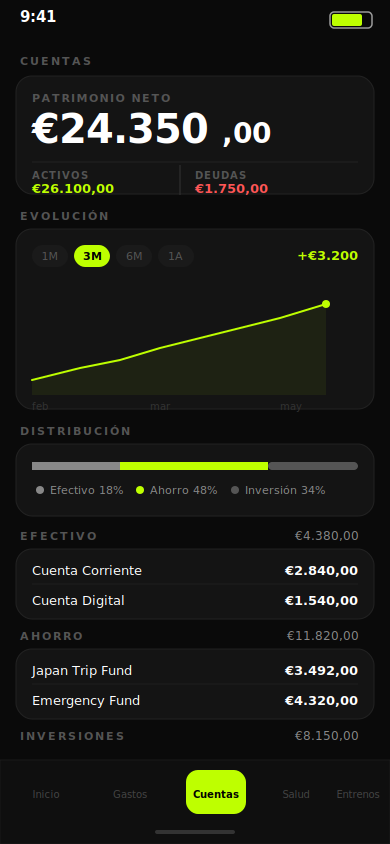
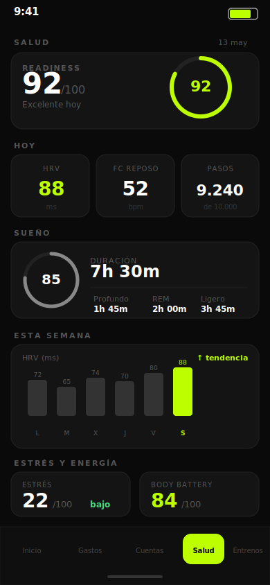

# Life OS 🧠

**A self-hosted personal dashboard that replaces spreadsheets — expenses captured automatically, health synced from Garmin, and AI delivering weekly insights to your phone.**

[](https://nextjs.org)
[](https://www.typescriptlang.org)
[](https://supabase.com)
[](https://tailwindcss.com)
[](https://n8n.io)
[](https://anthropic.com)

---

## What it does

No manual data entry. No subscription. No third party holding your bank data.

- **Tap to pay** → iOS Shortcut fires → n8n webhook → Claude Haiku categorises the expense → Supabase stores it → balance updated instantly
- **Open the app** → see your net worth, budget status, savings goal ETAs, and recent transactions in real time
- **Every Sunday 9am** → Claude reads your week's expenses and sends a personalised financial summary to Telegram in Spanish
- **Every night** → net worth snapshot stored, powering the history chart

---

## Screenshots

| Dashboard | Gastos | Cuentas | Salud |
|-----------|--------|---------|-------|
|  |  |  |  |

---

## Architecture

```
Revolut tap-to-pay
       │
       ▼
iOS Shortcut (Wallet trigger)
       │
       ▼
n8n webhook
       ├── Claude Haiku → categorise expense
       ├── Supabase INSERT expenses
       ├── Supabase RPC deduct_from_account
       └── Telegram confirmation ✅

n8n cron · Sunday 9am
       ├── Fetch week's expenses + account balances
       ├── Claude Haiku → weekly narrative summary
       └── Telegram report 📊

n8n cron · daily 23:50
       └── Supabase RPC snapshot_net_worth 📈

n8n cron · 1st of month
       └── Auto-insert fixed expenses (rent, etc.) 🏠
```

---

## Features

### 💰 Finance
- **Net worth** — real-time total across all accounts (cash · savings · investment · debt)
- **Budget tracking** — per-category progress bars, colour-coded by % used
- **Month-over-month** — every category shows % change vs last month
- **Expense log** — inline delete with automatic balance reversal (UNDO)
- **Savings goals** — progress bars + ETA calculated from your avg savings rate
- **Net worth chart** — 1M / 3M / 6M / 1Y history, updated every night

### 🏥 Health
- Daily Garmin sync via n8n: HRV, resting HR, steps, sleep, readiness, stress, body battery
- Workout log with RPE, load, and muscle groups
- Trend charts per metric

### 🤖 AI
- **Expense categorisation** — Claude Haiku picks the right budget category from merchant name + amount
- **Weekly report** — natural language summary of spending patterns, what went well, and one actionable suggestion

---

## Tech Stack

| Layer | Tech |
|-------|------|
| Frontend | Next.js 16 App Router, TypeScript, Tailwind CSS, shadcn/ui |
| Data fetching | SWR — instant navigation, no loading skeletons |
| Database | Supabase (PostgreSQL) with RLS + RPC functions |
| Auth | Supabase Auth — Google OAuth, single-user |
| Charts | Recharts |
| Automation | n8n self-hosted |
| AI | Claude Haiku (Anthropic API) |
| Notifications | Telegram Bot API |
| Hosting | Oracle Cloud Always Free + PM2 + Nginx + Cloudflare |

**Cost to run:** ~€0/month (Oracle free tier + Supabase free tier)

---

## Getting Started

### 1. Clone & install
```bash
git clone https://github.com/casanovaedu/life-os
cd life-os
npm install
```

### 2. Environment variables
```bash
cp .env.local.example .env.local
# Fill in your Supabase URL and anon key
```

### 3. Supabase setup
Run `docs/setup-net-worth-history.sql` in your Supabase SQL editor to create the snapshots table and RPC function.

### 4. Run locally
```bash
npm run dev
```

### 5. n8n automations
Import the workflow templates from `docs/`:
- `n8n-daily-snapshot.json` — net worth cron
- `n8n-weekly-report.json` — AI weekly report

Update the Supabase URL/key and Telegram credentials in each workflow.

---

## Design

- **Mobile-first** — built to be used on your phone, every day
- **Dark mode default** — single accent colour: electric lime `#BEFF00`
- **Liquid glass UI** — `backdrop-filter: blur` cards, no gradients
- **Read-heavy** — the app displays data; all writes come from automations

---

## Live demo

🌐 [life.educasanova.com](https://life.educasanova.com) *(private — login required)*

---

## License

MIT
